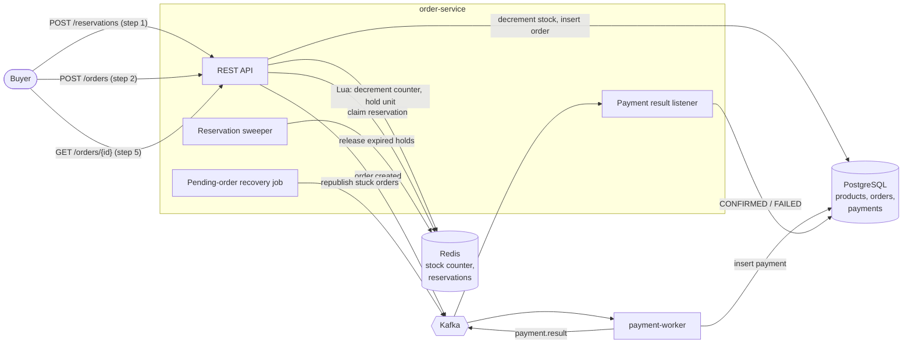

# Flash sale order service

An order service for a flash sale: thousands of buyers try to buy a product with 100 units in
the same few seconds. The service must never sell more units than it has, must not create an order
twice when a client retries, and must charge each order at most once, even when parts of the
system fail.

Built with Java 21, Spring Boot, PostgreSQL, Redis, Kafka and k6.

## How it works



1. **Reserve.** `POST /api/v1/reservations` runs a Lua script in Redis that takes one unit from
   the stock counter and holds it for the buyer for 5 minutes. Most buyers in a sale stop here
   with `409 sold out`, and they never touch Postgres.
2. **Order.** `POST /api/v1/orders` with the reservation ID and an `Idempotency-Key` header.
   The service claims the reservation in Redis, then, in one Postgres transaction, decrements
   `available_stock` and inserts the order as `PENDING_PAYMENT`. It returns `202`, and after the
   commit it publishes `order.created`.
3. **Pay.** The payment worker consumes `order.created`, simulates a charge (10% are declined),
   stores the payment and publishes `payment.result`.
4. **Settle.** The order service moves the order to `CONFIRMED` or `FAILED`. A declined payment
   returns its unit to Postgres and to the Redis counter, so another buyer can take it.
5. **Poll.** The buyer polls `GET /api/v1/orders/{id}` until the order is settled.

Postgres is the source of truth for stock. Redis is a fast filter in front of it: if the two
disagree, Postgres still refuses to sell a unit it does not have.

### What keeps it correct

| Problem | How it is handled |
|---|---|
| Overselling | A `CHECK (available_stock >= 0)` and a conditional `UPDATE` (see stock strategies below). |
| Client retries an order | `Idempotency-Key` per user: a transaction-scoped advisory lock serializes retries, and `UNIQUE (user_id, idempotency_key)` is the backstop. A retry gets the original order back. |
| Abandoned reservations | A sweeper releases expired holds every second and returns the units to the counter. Redis key-expiry events are not used, because their delivery is not guaranteed. |
| Crash after commit, before publish; Kafka down | The order is already in Postgres as `PENDING_PAYMENT`. A recovery job republishes `order.created` for orders pending longer than 2 minutes. |
| Duplicate `order.created` events | `UNIQUE (order_id)` on payments. The worker charges once and republishes the stored result on redelivery. |
| Duplicate `payment.result` events | Settlement only updates orders that are still `PENDING_PAYMENT`. |
| A message that keeps failing | 3 retries with backoff, then `order.created.DLT`, so one bad message cannot block its partition. |
| Redis loses its data | The counter is rebuilt from Postgres on the next request. |

## Running it

Requires Docker.

```bash
docker compose up -d --build
```

This starts Postgres, Redis, Kafka, the order service on port 8080, and the payment worker. Flyway
creates the schema and seeds product 1 with 100 units.

```bash
# Reserve a unit
curl -s -X POST localhost:8080/api/v1/reservations \
  -H 'X-User-Id: alice' -H 'Content-Type: application/json' -d '{"productId": 1}'

# Order with the reservation ID from the response
curl -s -X POST localhost:8080/api/v1/orders \
  -H 'X-User-Id: alice' -H 'Idempotency-Key: 7d3c...' -H 'Content-Type: application/json' \
  -d '{"reservationId": "<reservationId>"}'

# Check the order
curl -s localhost:8080/api/v1/orders/<orderId> -H 'X-User-Id: alice'
```

`X-User-Id` stands in for authentication.

Settings (environment variables for `docker compose up`):

| Variable | Default | Meaning |
|---|---|---|
| `STOCK_STRATEGY` | `ATOMIC` | `NAIVE`, `PESSIMISTIC`, `ATOMIC` or `OPTIMISTIC` |
| `RESERVATIONS_ENABLED` | `true` | `false` makes `POST /orders` take a `productId` and go straight to Postgres |
| `RESERVATION_HOLD` | `5m` | How long a reservation holds a unit |
| `DECLINE_RATE` | `0.1` | Share of payments the worker declines |

### Tests

```bash
cd order-service && ./mvnw test     # 36 tests
cd payment-worker && ./mvnw test    # 7 tests
```

The tests need JDK 21 or later, and Docker running for Testcontainers. They include concurrency tests that
fire many requests at once at each stock strategy, and end-to-end tests of the reservation,
idempotency and payment flows.

## Stock strategies

Without reservations, every buyer's order decrements the same Postgres row. Four ways to do it:

| Strategy | How it works |
|---|---|
| `NAIVE` | `SELECT` the stock, check it in Java, `UPDATE` it. Two buyers can read the same value. Kept to show the bug. |
| `PESSIMISTIC` | `SELECT ... FOR UPDATE`. Buyers queue on the row lock. |
| `ATOMIC` | `UPDATE ... SET available_stock = available_stock - 1 WHERE id = ? AND available_stock >= 1`. The check and the write happen in one statement. |
| `OPTIMISTIC` | Read the stock and its `version`, then `UPDATE ... WHERE version = ?`, and retry if another buyer got there first. |

## Load test results

5,000 buyers, 200 at a time, 100 units. These numbers come from a laptop running everything
in Docker Desktop (8 GB), with the full stack up, including Kafka and the payment worker.
Absolute numbers vary a lot between runs on this machine; compare rows within the same table,
not with other systems.

```bash
loadtest/run-strategies.sh    # direct orders, one run per stock strategy
loadtest/run-flash-sale.sh    # the full sale, with and without reservations
python loadtest/summarize.py  # markdown tables from loadtest/results/*.json
```

### Direct orders, by strategy

| Strategy | Requests/s | p50 ms | p95 ms | p99 ms | Orders created |
|---|---|---|---|---|---|
| `NAIVE` | 149 | 598 | 4,898 | 6,791 | **1,011** (oversold by 911) |
| `PESSIMISTIC` | 212 | 733 | 2,656 | 3,401 | 100 |
| `ATOMIC` | 313 | 344 | 2,147 | 3,659 | 100 |
| `OPTIMISTIC` | 272 | 465 | 2,509 | 3,734 | 100 |

`NAIVE` sold more than ten times the stock. The other three sold exactly 100. `ATOMIC` is the
fastest, because it holds the row lock for a single statement, and it is the default.

### Full sale, with and without reservations (ATOMIC)

| Run | Requests/s | p50 ms | p95 ms | p99 ms | Orders | Confirmed | Declined |
|---|---|---|---|---|---|---|---|
| With reservations | 426 | 184 | 1,098 | 2,754 | 107 | 100 | 7 |
| Without reservations | 324 | 368 | 2,163 | 3,293 | 113 | 100 | 13 |

Latency per step with reservations:

| Step | p50 ms | p95 ms | p99 ms |
|---|---|---|---|
| Reserve | 285 | 1,031 | 1,224 |
| Order | 2,354 | 4,935 | 5,587 |
| Poll | 73 | 1,109 | 3,013 |

Both runs confirmed exactly 100 orders. Declined orders returned their units, and those were
sold to later buyers, which is why more than 100 orders were placed. With reservations, 4,893 of
the 5,000 buyers were turned away by Redis without touching Postgres. Only the 107 buyers who got
a reservation reached the order step, and that step is slow because they all update the same row.
The median order settled 5.8 seconds after it was accepted.

## Failure tests

[docs/failure-tests.md](docs/failure-tests.md) covers killing the order service, flushing Redis
and stopping Kafka in the middle of a sale, and declining every payment. All of them ended with
every unit accounted for, no duplicate orders and no double charges. It also describes one known
gap: a crash between claiming the reservation and committing the order loses that unit from the
Redis counter, which can undersell but never oversell.

## Project layout

```
order-service/     Spring Boot service: REST API, stock strategies, Redis reservations, Kafka
payment-worker/    Spring Boot Kafka consumer that simulates payments
loadtest/          k6 scripts, run scripts, check.sh, and results
docs/              Failure test notes
docker-compose.yml
```
